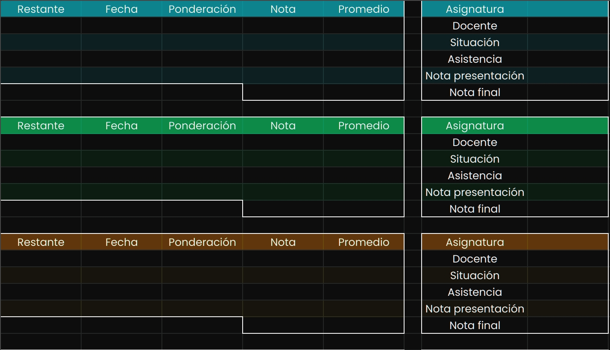

# google-sheets
Aplicación para obtener las notas de un semestre específico y subirlas a google
sheets.

# Uso
Para usar el programa debemos clonar la imagen de Docker, configurar las variables
de entorno, copiar las credenciales y ejecutar el contenedor. El resto del README
explica como hacer cada parte. Supongamos que tenemos las credenciales en el mismo
directorio de ejecución y llamamos al contenedor google-sheets, además nuestro
archivo de variables de entorno es google-sheets.env. Para correr el contenedor
haremos:

```
docker container create --name=google-sheets --env-file=google-sheets.env --restart=always ghcr.io/inacapi/google-sheets:1.1
docker cp credentials.json google-sheets:/app
docker start google-sheets
```

Podemos quitar `--restart=always` al comienzo para que no se reinicie en bucle en
caso que haya algún error, cuando estemos seguros que funciona bien podemos volver
a recrar el contenedor con esa opción.

## Google cloud
Para usar la aplicación debemos tener un proyecto en google cloud que tenga la
api de google sheets activa. Debemos generar una cuenta de servicio y generar
las credenciales para usarla. Tenemos que guardar el archivo de credenciales
como `credentials.json`, debemos guardar la ruta porque luego debemos mover el
archivo al contenedor, de lo contrario no va funcionar. El video siguiente
muestra cómo hacerlo:

https://user-images.githubusercontent.com/22999877/211126987-a6ff5c32-5b9e-4b37-a073-93e1016b8fd8.mp4

## Plantilla para las notas
Las notas deben subirse a una hoja de cálculo. Recomiendo usar
[esta](https://docs.google.com/spreadsheets/d/1d-Msd7tkd-620jALFpxMG8eG5GTKe-sj1XTuVdxJTRE)
porque el código tiene por defecto las celdas asignadas en base a esa
plantilla. Pueden hacer una copia y modificarla a gusto. Ciertas celdas traen
alertas para no editarlas, son celdas que contienen funciones, solo se activan
cuando están los demás datos necesarios. Es importante que la hoja la
compartamos con la cuenta de servicio que creamos antes, podemos usar el correo
que trae, sino lo hacemos el programa no va a funcionar porque la cuenta no
tiene acceso a la hoja de cálculo. Tenemos que darle el permiso de editor.

La plantilla de notas se ve así:


## Variables de entorno
Hay ciertas variables de entorno que deben definirse para que el programa pueda
funcionar, esta tabla las incluye todas:
| VARIABLE   | DESCRIPCION                             |
|------------|-----------------------------------------|
| USERNAME   | Nombre de usuario de inacap             |
| PASSWORD   | Contraseña de inacap                    |
| PERIODO    | Id del periodo                          |
| MATRICULA  | Id de nuestra matrícula                 |
| SECCIONES  | Id de las secciones                     |
| SHEET_NAME | Nombre de la hoja donde subir los datos |
| SHEET_ID   | Id de la hoja de cálculo                |
| RANGES     | Rangos donde subir los datos en la hoja |
| INTERVAL   | Tiempo en minutos entre cada ejecución  |
